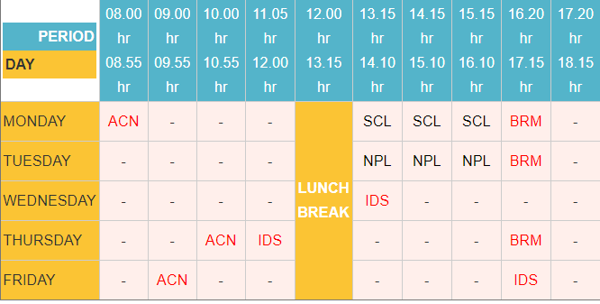

## Simple script to change timetable on NITRIS

After running the script, the timetable would look something like this.

### Map
**Red** - Theory  
**Black** - Lab

### Instructions

Just copy `script.js` and paste it on your console :) 